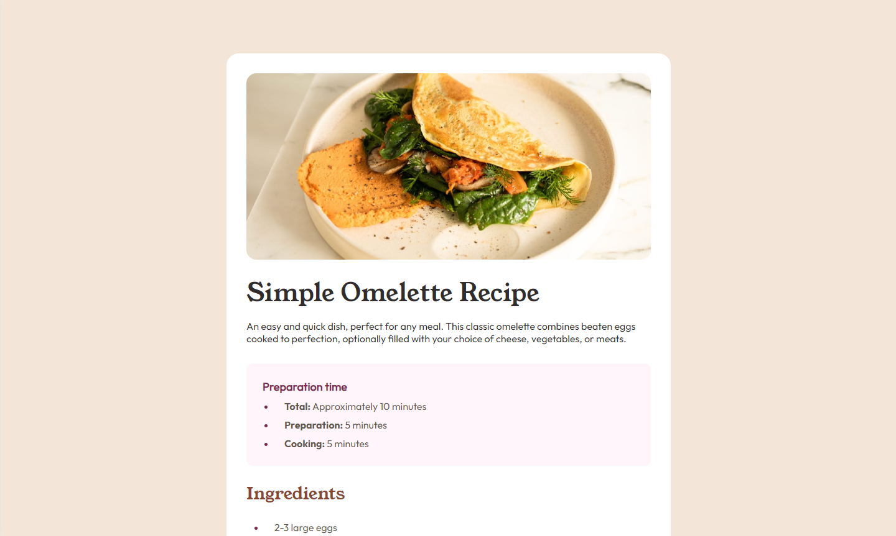
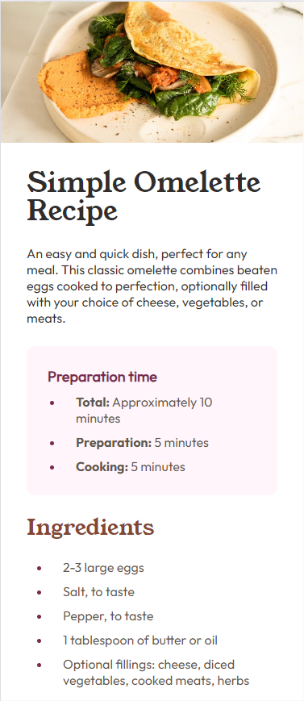

# Frontend Mentor - Recipe page solution

This is a solution to the [Recipe page challenge on Frontend Mentor](https://www.frontendmentor.io/challenges/recipe-page-KiTsR8QQKm). Frontend Mentor challenges help you improve your coding skills by building realistic projects. 

## Table of contents

- [Overview](#overview)
  - [The challenge](#the-challenge)
  - [Screenshot](#screenshot)
  - [Links](#links)
- [My process](#my-process)
  - [Built with](#built-with)
  - [What I learned](#what-i-learned)
- [Author](#author)

## Overview

### Screenshot

## Desktop Design

## Mobile Design

### Links

- Live Site URL: [Recipe Page](https://rkendall300.github.io/recipe-page/)

## My process

### Built with

- Semantic HTML5 markup
- CSS custom properties
- Flexbox

### What I learned

This project was mainly used to further solidify my HTML skills, particularly with making sure I use the correct HTML tags for each section. I haven't had a reason to use the ordered-list tag for most of my other projects up until this point, so that was nice to use. Because of how many list elements there are for this, I'm sure I could have used a more streamlined class system to make the CSS file not be so long, but each list had slightly different properties so I figured I would just make them all separate.

## Author

- Frontend Mentor - [@rkendall300](https://www.frontendmentor.io/profile/rkendall300)